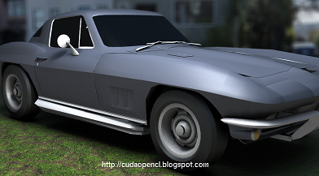
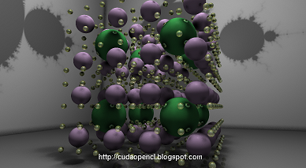
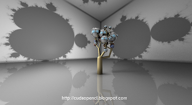
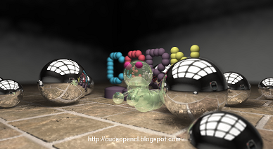
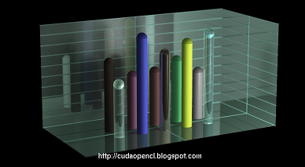
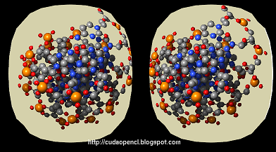

[](https://travis-ci.org/favreau/Sol-R)

### Introduction
Sol-R is a CUDA/OpenCL-based realtime ray-tracer compatible with Oculus Rift DK1, Kinect, Razor Hydra and Leap Motion devices.
Sol-R was used by the Interactive Molecular Visualiser project (http://www.molecular-visualization.com)

A number of videos can be found on my channel: https://www.youtube.com/user/CyrilleOnDrums

Sol-R was written as a hobby project in order to understand and learn more about CUDA and OpenCL. Most of the code was written at night and during week-ends, meaning that it's probably not the best quality ever ;-)

The idea was to produce a Ray-Tracer that has its own "personality". Most of the code does not rely on any litterature about ray-tracing, but more on a naive approach of what rays could be used for. The idea was not to produce a physically based ray-tracer, but a simple engine that could produce cool images interactively.

Take it for what it is! Sol-R is a lot of fun to play with if you like coding computer generated images.

May the fun continue with your contributions! :-)

```
usage: solrViewer
```

### Prerequeries

#### Mandatory
- CMake 3.5
- Glew 2.x
- Glut 3.7
- Cuda 8.0 or OpenCL 1.2

#### Optional
- Kinect SDK 1.8
- Oculus Rift DK1 SDK 0.2.5
- Sixense SDK
- Leap SDK 3.2.0

### Build
```
mkdir Build
cd Build
cmake .. -DCMAKE_PREFIX_PATH=<installation-folder>
make install
```
Note that the installation process with deploy extra files that are needed by the Sol-R viewer. Typically, textures, environment maps and OpenCL kernels. Therefore, it is required to run the solrViewer application from the installation folder.

### Run
```
<installation-folder>/bin/solrViewer
```

### Selecting CUDA or OpenCL

By default, the OpenCL engine is selected but this can be changed by modifying the SOLR_ENGINE option, using either ccmake or the following cmake option:
```
cmake .. -DSOLR_ENGINE:STRING=CUDA
```

Optional dependencies can be activated using the following cmake options:
```
cmake .. -DSOLR_KINECT_ENABLED=ON -DSOLR_OCULUS_ENABLED=ON -DSOLR_SIXENSE_ENABLED -DSOLR_LEAPMOTION_ENABLED=ON
```

### Screenshots











### Supported platforms

Sol-R has currently been tested on:
- Windows 7 with Visual Studio 2015 Community edition
- Mac OS X Sierra 10.12.15
- Ubuntu 16.04
